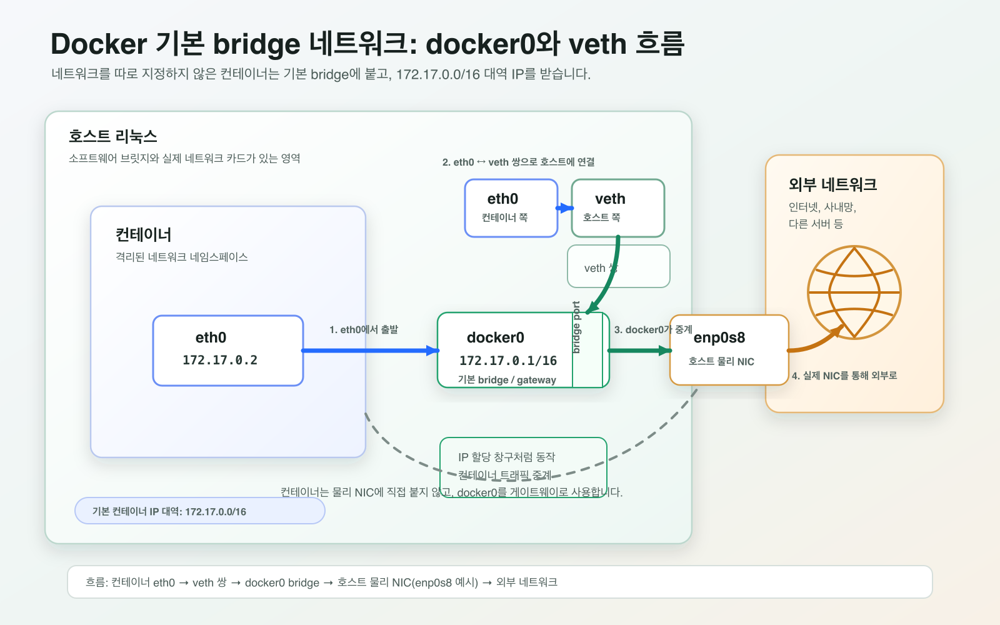

## 1. 개요
컨테이너는 기본적으로 호스트나 다른 컨테이너와 격리되어 있는 독립된 실행 환경이다. [Docker(5)](https://xoruddl.github.io/posts/Docker-5-network/)에서 사용자 정의 네트워크로 컨테이너끼리 이름으로 통신하는 방법을 다뤘는데, 이번 글에서는 그 배경이 되는 **기본 브릿지 네트워크의 동작 원리**와, 포트포워딩이 실제로 어떤 경로를 거쳐 컨테이너까지 도달하는지, 그리고 MySQL과 WordPress처럼 서로 다른 역할의 컨테이너 두 개를 네트워크로 묶어서 하나의 서비스로 동작시키는 방법을 정리한다.

---

## 2. 도커가 기본으로 쓰는 브릿지 네트워크
먼저 헷갈리지 않게 짚고 가면, 컨테이너는 별도의 컴퓨터가 아니라 **호스트 리눅스 위에서 격리된 채로 돌아가는 프로세스**일 뿐이다. 그래서 컨테이너가 외부와 통신하려면 결국 호스트 리눅스(= 도커 엔진이 설치되어 있는 그 컴퓨터)를 거쳐 나가야 하는데, 이때 중간 다리 역할을 하는 게 `docker0`라는 가상 브릿지다. 실제 네트워크 장비가 아니라 도커가 설치될 때 소프트웨어로 만들어주는 브릿지이고, 네트워크를 따로 지정하지 않고 띄운 컨테이너는 전부 이 브릿지에 자동으로 연결되어 `172.17.0.0/16` 대역의 IP를 하나씩 받는다.

컨테이너 하나가 만들어질 때부터 외부로 나가기까지 순서대로 따라가 보면 이렇다.

1. 컨테이너 안에는 `eth0`라는 네트워크 인터페이스가 하나 생긴다. 이건 컨테이너 입장에서 보이는 "내 네트워크 카드"다.
2. 이 `eth0`는 호스트 쪽에 짝으로 만들어지는 `veth`라는 가상 인터페이스와 파이프처럼 연결된다. 즉 컨테이너의 `eth0`로 나간 패킷은 그대로 호스트의 `veth`로 튀어나온다.
3. 이 `veth`가 `docker0` 브릿지에 꽂히면서, 컨테이너는 비로소 호스트의 네트워크 세계와 연결된다. `docker0`는 여기 연결된 컨테이너들에게 IP를 나눠주는 역할도 겸한다.
4. 마지막으로 `docker0`가 호스트의 실제 네트워크 카드(예: `enp0s8`)로 트래픽을 넘겨줘야 진짜 인터넷이나 사내망 같은 외부로 나갈 수 있다.

정리하면 각 구성 요소는 이런 역할을 맡는다.

| 인터페이스 | 위치 | 역할 |
| --- | --- | --- |
| `eth0` | 컨테이너 안 | 컨테이너가 갖는 네트워크 카드 |
| `veth` | 호스트 | 컨테이너의 `eth0`와 짝을 이뤄, 컨테이너 트래픽을 호스트로 끌어오는 통로 |
| `docker0` | 호스트 | `veth`들이 모이는 브릿지. 컨테이너에 IP를 나눠주고, 트래픽을 물리 NIC 쪽으로 중계 |
| `enp0s8` (예시) | 호스트 | 호스트가 실제로 외부와 통신하는 물리 네트워크 카드 |

핵심은 컨테이너의 `eth0`가 물리 네트워크에 직접 나가는 게 절대 아니라는 것이다. `eth0` → `veth` → `docker0` → 물리 NIC 순으로 한 단계씩 거쳐야 비로소 외부까지 도달한다.



---

## 3. 기본 브릿지 네트워크 확인해보기
```
# 도커가 제공하는 네트워크 드라이버 목록
docker network ls

# 기본 bridge 네트워크의 상세 정보
docker network inspect bridge
```

컨테이너 두 개를 별도 네트워크 지정 없이 띄우면 자동으로 `bridge` 네트워크에 붙는다.
```
docker run -dit --name container1 ubuntu:20.04
docker run -dit --name container2 ubuntu:20.04
```

각 컨테이너에 할당된 IP는 아래 명령으로 확인할 수 있다.
```
docker inspect container1 | grep IPAddress
```

---

## 4. 포트포워딩이 컨테이너까지 도달하는 과정
`-p` 옵션으로 포트를 열어둔 컨테이너에 브라우저로 접속하면, 실제로는 여러 단계를 거쳐 요청이 전달된다.

```
docker run -d --name nginx -p 8000:80 nginx
```

브라우저 주소창에 `http://호스트IP:8000`을 입력하면 일단 호스트 운영체제가 요청을 받는다. 이 시점에 호스트는 두 가지를 확인하는데, 8000번 포트가 실제로 열려 있는지, 그리고 그 포트가 어느 컨테이너와 매핑되어 있는지를 본다. 매핑된 컨테이너를 찾고 나면 도커 브릿지 네트워크 단에서 요청을 컨테이너의 사설 IP와 80번 포트로 바꿔서 넘겨주는데, 이 변환 작업이 바로 NAT다.

정리하면 `-p 8000:80`은 단순히 두 포트 번호를 나열해둔 게 아니라, "호스트의 8000번으로 들어온 요청을 컨테이너 내부 IP의 80번으로 NAT 처리해서 전달하라"는 규칙을 등록하는 옵션인 셈이다.

---

## 5. 네트워크 관련 명령어 정리

| 명령 | 역할 |
| --- | --- |
| `docker network ls` | 네트워크 목록 조회 |
| `docker network create` | 네트워크 생성 |
| `docker network inspect` | 네트워크 상세 정보 확인 |
| `docker network connect` | 실행 중인 컨테이너를 네트워크에 새로 연결 |
| `docker network disconnect` | 네트워크에서 컨테이너 연결 해제 |
| `docker network rm` | 네트워크 삭제 |
| `docker network prune` | 사용하지 않는 네트워크 일괄 삭제 |

---

## 6. 실전 예제: MySQL과 WordPress 연동하기
WordPress는 여러 컨테이너를 엮어서 하나의 서비스를 완성해야 하는 대표적인 사례라서 연습 삼아 직접 붙여봤다. 도커 허브의 공식 WordPress 이미지를 받아보면 Apache와 PHP 런타임까지는 이미지 안에 다 들어있는데, 정작 데이터를 저장할 데이터베이스는 빠져 있다. 게다가 아무 DB나 붙일 수 있는 게 아니라 MySQL이나 MariaDB로 지원 범위가 정해져 있어서, 결국 DB 컨테이너를 따로 띄우고 네트워크로 연결해주는 과정이 필수다.

**네트워크 생성**
```
docker network create wordnetwork
```

**MySQL 컨테이너 실행**
```
docker run --name mysql -dit \
    --net=wordnetwork \
    -e MYSQL_ROOT_PASSWORD=1234 \
    -e MYSQL_DATABASE=wordpress \
    -e MYSQL_USER=adam \
    -e MYSQL_PASSWORD=1234 \
    mysql \
    --character-set-server=utf8mb4 \
    --collation-server=utf8mb4_unicode_ci
```
`MYSQL_DATABASE`/`MYSQL_USER`/`MYSQL_PASSWORD`로 WordPress가 사용할 DB와 계정을 미리 만들어두고, `--character-set-server`/`--collation-server`로 문자 인코딩과 정렬 방식을 `utf8mb4`(이모지 포함 다국어 지원)로 지정했다.

**WordPress 컨테이너 실행**
```
docker run \
    --name=wordpress -dit \
    --net=wordnetwork \
    -p 8000:80 \
    -e WORDPRESS_DB_HOST=mysql \
    -e WORDPRESS_DB_NAME=wordpress \
    -e WORDPRESS_DB_USER=adam \
    -e WORDPRESS_DB_PASSWORD=1234 \
    wordpress
```
같은 `wordnetwork`에 연결했기 때문에 `WORDPRESS_DB_HOST`에 IP 대신 컨테이너 이름 `mysql`을 그대로 쓸 수 있다. `http://호스트IP:8000`으로 접속하면 WordPress 초기 설치 화면이 뜨고, 앞서 지정한 DB 계정으로 정상적으로 데이터베이스에 연결된 것을 확인할 수 있다.

**정리**
```
docker stop wordpress mysql
docker rm wordpress mysql
docker network rm wordnetwork
```
네트워크는 그 네트워크에 연결된 컨테이너가 모두 정리된 뒤에야 삭제할 수 있다.

---

## 7. 정리
도커는 기본적으로 `docker0` 브릿지와 `veth` 쌍을 이용해 컨테이너에 IP를 할당하고 호스트와 연결하며, `-p` 옵션으로 연 포트는 이 브릿지에서 NAT를 거쳐 컨테이너 내부 포트로 전달된다는 걸 확인했다. 기본 `bridge` 네트워크만으로도 통신은 가능하지만, MySQL·WordPress 예제처럼 사용자 정의 네트워크를 직접 만들어 연결하면 컨테이너 이름을 그대로 호스트처럼 쓸 수 있어서, 여러 컨테이너로 구성된 서비스를 훨씬 다루기 쉬워진다.
