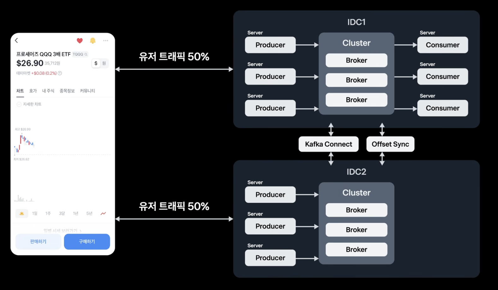

Kafka를 처음 접하면 Producer, Consumer, Broker, Topic, Partition 같은 용어가 한꺼번에 등장해 복잡하게 느껴진다. 이번 글에서는 주문 생성 이벤트를 예로 들어 각 개념이 어떻게 연결되는지 정리한다.

또한 Kafka 클러스터 내부의 복제와 리전 단위 장애에 대비하는 클러스터 이중화 구조까지 살펴보며, Kafka를 단순한 메시지 큐가 아니라 분산 이벤트 스트리밍 플랫폼으로 이해해본다.

> 이 글은 토스 데이터 엔지니어의 발표에서 소개된 **토스증권 Kafka 이중화 구조**를 참고해 개인적으로 정리한 내용이다. 발표 자료의 구조를 Kafka의 기본 개념과 연결해 이해하는 데 목적이 있으며, 토스증권의 실제 운영 환경 전체를 그대로 설명하거나 공식 아키텍처를 재현한 글은 아니다.

---

## 1. Kafka는 어떤 문제를 해결할까

마이크로서비스 환경에서 주문이 생성되면 결제, 알림, 통계, 배송과 같은 후속 작업이 이어질 수 있다. 주문 서비스가 이 서비스들을 HTTP로 직접 호출하면 호출 대상 중 하나의 장애나 느린 응답이 주문 처리 전체에 영향을 줄 수 있다.

Kafka를 중간에 두면 주문 서비스는 주문 생성 이벤트를 Kafka에 기록하고, 각 서비스는 자신이 처리할 이벤트를 읽어간다.

```text
주문 서비스(Producer)
        │ 주문 생성 이벤트
        ▼
Kafka Topic: order-events
        ├── 결제 서비스(Consumer)
        ├── 알림 서비스(Consumer)
        └── 통계 서비스(Consumer)
```

Producer와 Consumer가 서로 직접 호출하지 않으므로 한 서비스의 처리 속도나 일시적인 장애가 다른 서비스에 즉시 전파되는 것을 줄일 수 있다. Kafka는 메시지를 전달하는 동시에 일정 기간 이벤트를 저장하므로, Consumer는 자신의 처리 위치에 따라 이벤트를 다시 읽을 수도 있다.

---

## 2. Kafka의 핵심 용어

| 용어 | 의미 |
| --- | --- |
| Producer | Kafka Topic에 레코드를 기록하는 애플리케이션 |
| Consumer | Kafka에서 레코드를 읽어 업무를 처리하는 애플리케이션 |
| Topic | 이벤트를 분류하는 논리적인 이름 |
| Partition | Topic을 여러 개로 나눈 순서 있는 로그 조각 |
| Broker | Partition 데이터를 저장하고 요청을 처리하는 Kafka 서버 |
| Consumer Group | 같은 업무를 여러 Consumer가 나눠 처리하기 위한 그룹 |
| Offset | Partition 안에서 레코드의 위치를 나타내는 번호 |
| Replication Factor | Partition을 포함하는 복제본의 개수 |

Kafka의 레코드는 보통 key와 value로 구성한다.

```json
{
  "key": "order-100",
  "value": {
    "type": "ORDER_CREATED",
    "amount": 30000
  }
}
```

key는 어느 Partition에 저장할지를 결정하는 데 사용하고, value에는 실제 이벤트 데이터를 담는다. 이벤트의 종류나 주문 번호처럼 Consumer가 처리에 필요한 정보는 value 또는 헤더에 명확히 포함하는 것이 좋다.

---

## 3. Producer와 Consumer의 동작 방식

Producer는 이벤트를 Topic에 기록한다.

```text
주문 서비스(Producer) ──> order-events Topic
```

Consumer는 자신에게 할당된 Partition을 `poll` 방식으로 읽는다. Kafka가 모든 메시지를 Consumer에게 무조건 밀어 넣는 방식이라기보다는, Consumer가 주기적으로 Broker에 읽을 데이터를 요청하는 구조에 가깝다.

```text
Consumer: "내가 맡은 Partition에 새 레코드가 있나요?"
Broker:   "offset 120부터 읽을 수 있습니다."
```

Consumer가 레코드를 처리한 뒤 offset을 commit하면 Kafka는 해당 Consumer Group이 어디까지 처리했는지 기록한다. Consumer가 장애로 재시작하면 마지막으로 commit한 위치를 기준으로 다시 읽을 수 있다.

```text
Partition 0
[offset 120] [offset 121] [offset 122]
                          ▲
                  처리 후 commit한 위치
```

처리와 commit 사이에 Consumer가 중단되면 같은 레코드가 다시 전달될 수 있다. 따라서 결제, 쿠폰 발급, 포인트 적립처럼 중복 처리가 위험한 작업은 멱등성을 함께 설계해야 한다.

예를 들어 주문 번호를 멱등성 키로 저장하고 이미 처리한 주문이면 실제 작업을 다시 수행하지 않도록 만들 수 있다.

```text
if orderId가 이미 처리됨:
    성공으로 간주하고 종료
else:
    작업 수행 후 orderId 저장
```

---

## 4. Topic과 Partition

Topic은 하나의 거대한 메시지 목록이 아니라 여러 Partition으로 나뉜다.

```text
order-events
├── Partition 0: [A] [D] [G]
├── Partition 1: [B] [E] [H]
└── Partition 2: [C] [F] [I]
```

각 Partition은 레코드가 뒤에 계속 추가되는 로그이며, 레코드에는 Partition 내부에서 증가하는 offset이 부여된다.

```text
Partition 0
offset 0: 주문 생성
offset 1: 결제 완료
offset 2: 배송 시작
```

Kafka가 보장하는 순서는 Topic 전체가 아니라 **같은 Partition 내부의 순서**다. 따라서 `order-100`에 대한 `주문 생성 → 결제 완료 → 배송 시작` 순서를 유지해야 한다면 관련 이벤트가 같은 Partition에 기록되어야 한다.

### key로 Partition을 선택하는 이유

Producer는 보통 `orderId`나 `userId`를 key로 지정한다. 기본적인 key 기반 파티셔닝에서는 같은 key가 같은 Partition으로 전달되므로, 한 주문에 대한 이벤트 순서를 유지하기 쉽다.

```text
key = order-100
├── 주문 생성  ──> Partition 0
├── 결제 완료  ──> Partition 0
└── 배송 시작  ──> Partition 0
```

다만 Partition 수를 변경하면 key와 Partition의 매핑이 달라질 수 있다. Partition 수를 늘리는 작업은 단순한 용량 변경이 아니라 순서 보장 방식에도 영향을 줄 수 있으므로, key별 순서가 중요한 Topic은 변경 전에 충분히 검토해야 한다.

key를 지정하지 않은 레코드는 여러 Partition으로 분산될 수 있다. 이 경우 Topic 전체의 순서는 보장되지 않으므로, 특정 주문이나 사용자 단위의 이벤트 순서가 중요하다면 `orderId`나 `userId` 같은 key를 명시하는 것이 좋다.

---

## 5. Partition은 병렬 처리의 단위다

Partition이 여러 개인 이유는 Producer의 기록과 Consumer의 처리를 병렬화하기 위해서다.

```text
order-events
├── P0 ── Consumer A
├── P1 ── Consumer B
└── P2 ── Consumer C
```

같은 Consumer Group 안에서는 특정 시점에 Partition 하나를 Consumer 하나만 담당한다. 따라서 Partition이 3개라면 해당 Group에서 동시에 처리할 수 있는 Consumer의 최대 개수도 3개다.

```text
payment-group
├── Consumer A ── P0
├── Consumer B ── P1
└── Consumer C ── P2
```

Consumer를 5개로 늘려도 Partition이 3개라면 2개의 Consumer는 할당받을 Partition이 없어 대기하게 된다.

```text
Partition 3개 + Consumer 5개
→ 실제로 동시에 처리하는 Consumer는 최대 3개
```

결국 Partition 수는 순서 보장 범위와 Consumer Group의 최대 병렬성을 함께 결정한다. Partition 수를 정할 때는 예상 처리량, Consumer의 처리 속도, key별 순서 요구사항을 함께 고려해야 한다.

---

## 6. Consumer Group이 다르면 같은 이벤트를 각각 읽는다

같은 Consumer Group에 속한 Consumer들은 하나의 업무를 나눠 처리한다. 반면 서로 다른 업무를 수행하는 서비스는 서로 다른 Group을 사용한다.

```text
order-events
├── payment-group      → 결제 처리
├── notification-group → 알림 발송
└── analytics-group    → 통계 적재
```

각 Consumer Group은 자신의 offset을 별도로 관리한다. 따라서 동일한 `ORDER_CREATED` 이벤트를 결제, 알림, 통계 서비스가 각각 독립적으로 읽을 수 있다.

반대로 결제 처리량을 늘리기 위해 Consumer 인스턴스를 여러 개 실행할 수 있다. 이 Consumer 인스턴스들을 같은 `payment-group`에 넣으면 Kafka가 Partition을 Consumer 인스턴스별로 나누어 할당한다. 따라서 하나의 이벤트가 모든 Consumer 인스턴스에 중복 전달되지 않고, 각 Consumer 인스턴스가 서로 다른 Partition의 이벤트를 나누어 처리한다.

```text
하나의 Topic
├── payment-group      → 결제 업무를 분산 처리
├── notification-group → 알림 업무를 독립 처리
└── analytics-group    → 통계 업무를 독립 처리
```

---

## 7. Broker와 Kafka Cluster

Broker는 Kafka가 실행되는 서버 한 대를 의미한다. 물리 서버, VM, 클라우드 인스턴스, Kubernetes Pod 등이 Broker가 될 수 있다.

```text
Kafka Cluster
├── Broker 1
├── Broker 2
└── Broker 3
```

하나의 Broker에는 하나의 Partition만 저장되는 것이 아니다. 여러 Topic에 속한 여러 Partition이 Broker 사이에 분산될 수 있다.

```text
Broker 1                 Broker 2
├── order-events P0      ├── order-events P1
├── payment-events P2    └── payment-events P0
└── user-events P1
```

Consumer와 Broker도 1:1 관계가 아니다. Consumer는 자신에게 할당된 Partition의 Leader가 있는 Broker와 통신한다. 이때 하나의 Consumer가 반드시 하나의 Partition만 담당하는 것은 아니다. 같은 Consumer Group 안에서 하나의 Partition은 Consumer 하나만 담당하지만, Partition 수가 Consumer 수보다 많으면 하나의 Consumer가 여러 Partition을 맡을 수 있다.

담당하는 Partition들이 서로 다른 Broker에 저장되어 있다면, 하나의 Consumer는 여러 Broker와 통신하게 된다. 예를 들어 Consumer A가 Broker 1의 Partition 0과 Broker 2의 Partition 1을 함께 담당할 수 있다.

```text
Broker 1 ── Partition 0 ──┐
                          ├── Consumer A
Broker 2 ── Partition 1 ──┘
```

---

## 8. Partition 복제와 Broker 장애 대응

운영 환경에서는 Partition을 여러 Broker에 복제해 하나의 Broker 장애가 전체 데이터 손실로 이어지지 않도록 한다. 복제본 중 하나는 Leader이고, 나머지는 Follower Replica다.

```text
order-events P0
├── Broker 1: Leader
├── Broker 2: Follower Replica
└── Broker 3: Follower Replica
```

일반적으로 Producer의 쓰기 요청은 Leader가 받고, Follower는 Leader의 데이터를 따라간다. Leader Broker에 장애가 발생하면 동기화 상태가 양호한 Replica 중 하나가 새 Leader가 되어 서비스를 이어간다.

복제 계수(Replication Factor)가 3이면 하나의 Partition에 대한 데이터 사본이 총 3개 존재한다. Broker가 한 대뿐이면 다른 서버에 복제할 수 없으므로 복제 계수를 3으로 설정할 수 없고, 실질적인 장애 대비도 불가능하다.

반대로 테스트 환경처럼 Broker가 한 대뿐인 경우에는 복제 계수를 1로 설정한다. 이때는 원본 Partition 하나만 존재하므로 개발과 실습에는 적합하지만, 해당 Broker가 장애 나면 복제본을 이용해 복구할 수 없다.

운영 환경의 시작점으로 다음과 같은 구성을 고려할 수 있다.

```text
Broker 3대
Replication Factor 3
min.insync.replicas 2
Producer acks=all
```

`acks=all`은 Producer가 충분한 Replica의 확인을 받은 뒤 쓰기 성공으로 판단하도록 한다. `min.insync.replicas=2`는 최소 2개의 동기화 Replica가 있을 때만 쓰기를 허용하는 방식이다. 내구성을 높이는 대신 Replica 확인을 기다리는 만큼 지연 시간과 처리량에 비용이 생길 수 있다.

---

## 9. 리전 장애와 Kafka 클러스터 이중화

클러스터 내부의 복제는 Broker 장애에 대비하는 방법이다. 하지만 동일한 데이터센터나 리전 전체에 문제가 발생하면 별도의 Kafka 클러스터와 클러스터 간 데이터 복제가 필요하다.

이번에 참고한 토스증권 구조는 두 IDC 모두 사용자 트래픽을 처리하고 Producer와 Kafka Cluster를 실행하지만, Consumer는 한쪽 IDC에서만 활성화하는 방식이다.

```text
사용자 트래픽 50%                 사용자 트래픽 50%
       │                                  │
       ▼                                  ▼
      IDC1                               IDC2
 Producer + Kafka Cluster           Producer + Kafka Cluster
 Consumer 활성                      Consumer 대기
```



*토스증권 Kafka 이중화 구조를 참고해 정리한 개념도. 두 IDC의 Producer와 Kafka Cluster는 활성화되어 있지만 Consumer는 한쪽 IDC에서만 동작한다.*

### Producer Active/Active와 Consumer Single Active

두 IDC 모두 Producer가 실행되고 사용자 요청도 양쪽으로 분산되므로 Producer 관점에서는 Active/Active 구성이다. 반면 Consumer는 같은 이벤트를 양쪽에서 동시에 처리하지 않도록 IDC1에서만 활성화한다.

```text
IDC1
├── Producer: 활성
├── Kafka Cluster: 활성
└── Consumer: 활성

IDC2
├── Producer: 활성
├── Kafka Cluster: 활성
└── Consumer: 대기
```

평상시에는 IDC1의 Consumer가 이벤트를 처리하고, IDC1에 장애가 발생하면 IDC2의 Consumer를 활성화한다. 이때 장애가 발생한 시점의 Consumer Group 처리 위치를 확인해 IDC2의 Consumer가 적절한 위치부터 이어서 읽도록 하는 절차가 필요하다.

따라서 이 구조 전체는 **Producer와 사용자 트래픽은 Active/Active이고, Consumer는 Single Active 또는 Active/Standby인 혼합 구조**라고 볼 수 있다.

Consumer를 한 IDC에서만 실행하는 목적은 두 Consumer가 같은 업무를 동시에 수행하면서 결제, 주문, 정산 같은 이벤트를 중복 처리하는 상황을 줄이기 위해서다. 다만 장애 전환 시에는 클러스터 간 복제 지연이나 처리 후 commit 전에 발생한 장애 때문에 일부 이벤트가 다시 전달될 수 있으므로, Consumer의 멱등성 처리는 여전히 필요하다.

| 구성 | 동작 방식 | 특징 |
| --- | --- | --- |
| Active/Passive | 평상시 한쪽 IDC만 사용하고 장애 시 다른 IDC로 전환 | 구조가 비교적 단순하지만 전환 절차가 필요 |
| Active/Active | 두 IDC를 모두 사용하고 양쪽에서 애플리케이션을 처리 | 자원 활용은 높지만 중복·충돌 관리가 복잡 |
| 현재 구조 | 두 IDC의 Producer와 Kafka는 활성화하고 Consumer는 한 IDC에서만 처리 | 트래픽은 양쪽으로 분산하면서 Consumer 중복 처리를 방지 |

클러스터 간 복제는 네트워크를 거치는 작업이므로 복제 지연이 발생할 수 있다. 또한 Kafka만으로 애플리케이션이 자동으로 다른 IDC로 전환되는 것은 아니다. DNS, 로드밸런서, 애플리케이션 설정, Consumer 활성화 절차, 데이터 정합성까지 함께 설계해야 한다.

---

## 10. 정리

Kafka에서 Partition은 순서와 병렬성의 단위다. Kafka는 Topic 전체의 순서를 보장하지 않고 같은 Partition 안에서만 순서를 보장하므로, 주문 번호처럼 순서가 중요한 기준을 key로 사용해 관련 이벤트를 같은 Partition으로 보내는 설계가 중요하다.

Consumer Group은 같은 업무를 여러 Consumer가 나눠 처리하는 단위다. 같은 Group 안에서는 Partition 하나를 Consumer 하나만 담당하고, 서로 다른 Group은 각자의 offset으로 같은 이벤트를 독립적으로 읽는다.

클러스터 내부의 Partition 복제는 Broker 장애에 대비하고, 별도 Kafka 클러스터 간 복제는 데이터센터나 리전 장애에 대비한다. 최종적으로 Kafka를 설계할 때는 이벤트 순서 기준, 필요한 병렬성, 멱등성, 복제 수준, 장애 전환 절차를 하나의 흐름으로 함께 결정해야 한다.

## 참고 자료

- [토스 유튜브 - 토스ㅣSLASH 23 - Kafka 이중화로 다양한 장애 상황 완벽 대처하기](https://www.youtube.com/watch?v=Pzkioe7Dvo4)
- [Apache Kafka 공식 문서](https://kafka.apache.org/documentation/)
- [Apache Kafka 복제 설계](https://kafka.apache.org/42/design/design/)
- [Confluent Partition 수 산정 가이드](https://docs.confluent.io/kafka/operations-tools/partition-determination.html)
